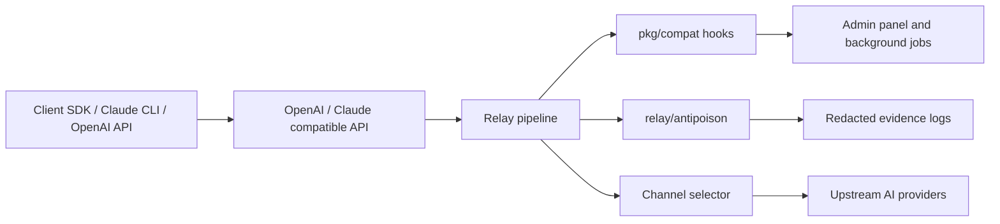
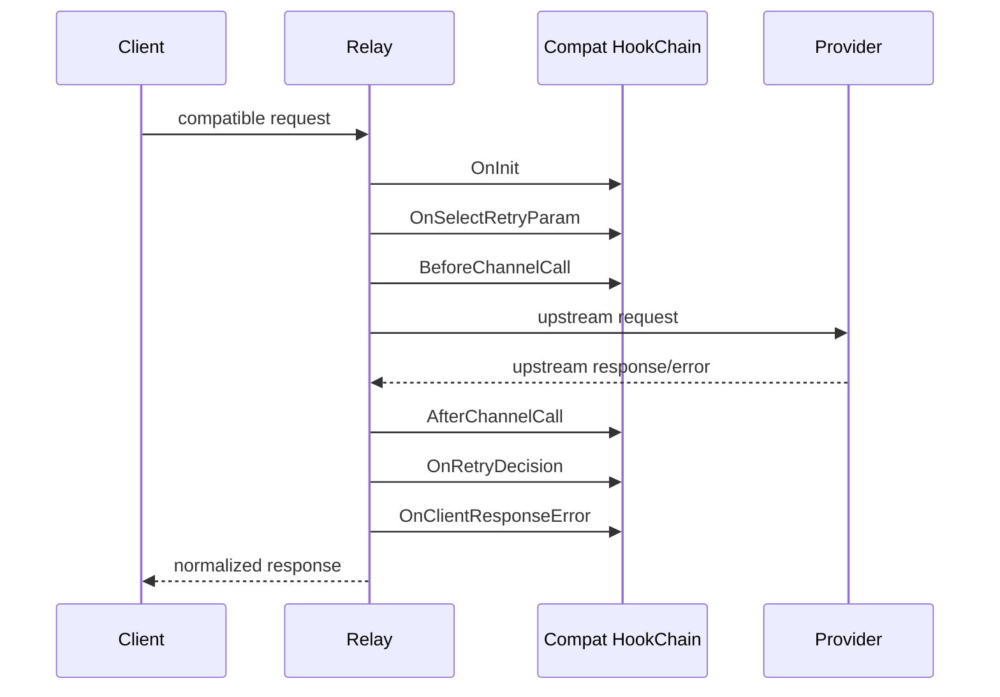

# renewapi

`renewapi` is a source fork of [QuantumNous/new-api](https://github.com/QuantumNous/new-api), currently based on upstream `v1.0.0-rc.11`.

It keeps the upstream API surface and data model compatible while adding a compatibility layer, profile-based anti-poison controls, hardened runtime defaults, and a source-first Docker build workflow.

> Repository name: `renewapi`
>
> Published image: `ghcr.io/alex-ai-dev-lab/newapi-compat-image`
>
> Go module path remains `github.com/QuantumNous/new-api` to reduce upstream merge conflicts.

## What It Is

`renewapi` is an AI provider gateway and management panel. It exposes OpenAI / Claude compatible APIs to clients, then routes traffic through configured channels with quota, billing, rate limiting, observability, and admin controls.

This fork focuses on two areas:

- **Compatibility hardening**: safer sessions, automatic secure-cookie behavior, localhost-only pprof, provider error normalization, per-channel upstream TLS options, and deployment scripts.
- **Anti-poison controls**: channel risk profiles, optional probes, response envelope validation, opaque payload scanning, and tool-call guard checks without injecting canary text into normal user requests.



## Tech Stack

| Layer | Stack |
| --- | --- |
| Backend | Go, Gin, GORM v2 |
| Frontend | `web/default`: React 19 + TypeScript + Rsbuild + Base UI + Tailwind |
| Classic frontend | `web/classic`: React 18 + Vite + Semi Design |
| Frontend package manager | Bun |
| Database | SQLite by default, MySQL and PostgreSQL supported |
| Cache | Redis and in-process cache |
| Auth | JWT, WebAuthn, OAuth |
| Image | Multi-stage Docker build, non-root Alpine runtime |

## Repository Layout

The project keeps the upstream NewAPI source layout:

```text
router/        route registration
controller/    HTTP handlers
service/       business logic
model/         GORM models
relay/         provider adapters and relay pipeline
middleware/    request middleware
setting/       runtime configuration
web/default/   primary frontend
web/classic/   classic frontend
```

Fork-specific compatibility and security work mainly lives in:

```text
pkg/compat/          relay hooks, error normalization, schedulers, price sync
relay/antipoison/    channel profiles, envelope checks, scanners, tool guard
scripts/             build, push, deploy, rollback, upstream sync helpers
docs/                fork-specific notes
legacy/patches/      retained for audit only; not used by builds or runtime
```

## Compatibility Layer

`pkg/compat` adds hook points around the relay flow instead of rewriting the upstream path directly.



Hook rules:

- Hooks should be idempotent.
- Disabled features should add near-zero hot-path overhead.
- Hook failures must not panic the relay path.
- Default behavior is fail-open unless a strict policy explicitly blocks a response.

## Anti-Poison Profiles

Anti-poison behavior is optional and channel-scoped. Normal user traffic no longer receives canary text by default; probes use canaries separately.

| Profile | Typical Use | Behavior |
| --- | --- | --- |
| `trusted` | Known-good production channel | Direct streaming, light scanning, no envelope requirement |
| `unknown` | Newly added or unclassified channel | Short TTL probing, first-byte buffering, score-based opaque scanning |
| `probation` | Production channel under stricter review | Non-stream envelope checks, stricter tool guard, streaming aggregation/replay |
| `quarantine` | Unsafe or investigation-only channel | Probe-only, excluded from production routing |

Per-channel override example:

```json
{"anti_poison_profile": "trusted"}
```

Main checks:

- **Answer envelope**: probation non-stream responses can be required to bind output to a nonce.
- **Opaque scan**: detects zero-width characters, bidi overrides, control characters, dense percent-encoding, long base64/hex blocks, and high-entropy fragments.
- **Tool-call guard**: validates guard markers around real tool calls to reduce tool-call injection risk.
- **Evidence logs**: writes redacted evidence under `/app/logs/anti-poison/`; authorization, key, token, and password-like fields are redacted.

## Configuration Highlights

| Variable | Purpose |
| --- | --- |
| `SESSION_SECRET` | Required. Startup should reject empty or default placeholder secrets. |
| `COOKIE_SECURE` | Cookie Secure behavior; can be inferred from service URL. |
| `SQL_DSN` | Database DSN. Empty value falls back to SQLite. |
| `SQLITE_PATH` | SQLite database path. |
| `REDIS_CONN_STRING` | Redis connection string. |
| `PORT` | Container listen port, default `3000`. |
| `NEWAPI_HOST_PORT` | Host port used by compose, default `3002`. |
| `PUID` / `PGID` | Runtime user/group IDs for non-root execution. |
| `TZ` | Runtime timezone. |
| `ENABLE_PPROF` | Enables pprof on localhost only. |
| `TLS_INSECURE_SKIP_VERIFY` | Global upstream TLS skip switch. Prefer per-channel TLS settings. |
| `OFFICIAL_PRICE_SYNC_ENABLED` | Enables official price sync jobs. Default is off. |

For self-signed, expired, or private upstream certificates, prefer the channel-level "skip upstream TLS certificate verification" option instead of enabling the global TLS bypass.

## Quick Start

```bash
cp .env.example .env
docker compose -f compose.yaml up -d
curl -fsS http://127.0.0.1:3002/api/status
```

The default compose path uses SQLite. MySQL and PostgreSQL examples are documented in `compose.yaml` and `docs/deploy.md`.

If old volumes were created as root, fix ownership once:

```bash
sudo chown -R 1000:1000 data logs public
```

## Build

Docker builds directly from the current source tree:

```bash
docker buildx build --platform linux/amd64,linux/arm64 \
  --build-arg VERSION=dev \
  --build-arg COMMIT_SHA="$(git rev-parse HEAD)" \
  --build-arg BUILD_DATE="$(date -u +%Y-%m-%dT%H:%M:%SZ)" \
  --build-arg UPSTREAM_REF=v1.0.0-rc.11 \
  -t ghcr.io/alex-ai-dev-lab/newapi-compat-image:dev .
```

Local single-arch build:

```powershell
.\scripts\local-build.ps1 -Image ghcr.io/alex-ai-dev-lab/newapi-compat-image:dev -Load
```

Multi-arch push:

```bash
VERSION=v1.0.0 ./scripts/local-build.sh --push
```

CI publishes GHCR images through `.github/workflows/build-release.yml` with the repository `GITHUB_TOKEN`.

## Deploy

Local secrets are loaded from `Token/` and must not be committed.

```powershell
.\scripts\deploy-server.ps1 -Image ghcr.io/alex-ai-dev-lab/newapi-compat-image:latest
.\scripts\rollback-server.ps1
```

Use `-DryRun` on deployment scripts when checking generated commands before switching a live service.

## Upstream Sync

`main` should use merge commits for upstream sync so production releases remain traceable. Feature branches may use rebase.

```bash
bash scripts/check-upstream.sh
bash scripts/sync-upstream.sh --merge --dry-run
bash scripts/sync-upstream.sh --merge
```

PowerShell equivalents:

```powershell
.\scripts\check-upstream.ps1
.\scripts\sync-upstream.ps1 -Mode merge -DryRun
.\scripts\sync-upstream.ps1 -Mode merge
```

When conflicts occur, prefer upstream behavior unless fork compatibility or security behavior must be preserved. Run at least:

```bash
go test ./relay/antipoison ./service ./model ./controller
```

Rebuild frontend assets before publishing Docker images.

## Security

- Never commit local credentials or generated secret files.
- `Token/`, `.env`, `*.secret`, `*.local.env`, `github-auth.env`, `server-access.env`, `*.pem`, and `id_rsa*` are ignored by Git and Docker build context.
- Scripts must not print tokens, passwords, sudo passwords, API keys, or bearer values.
- Report security-sensitive issues privately to the repository owner.

## License

This fork follows the upstream license. See:

- `LICENSE`
- `NOTICE`
- `THIRD-PARTY-LICENSES.md`
